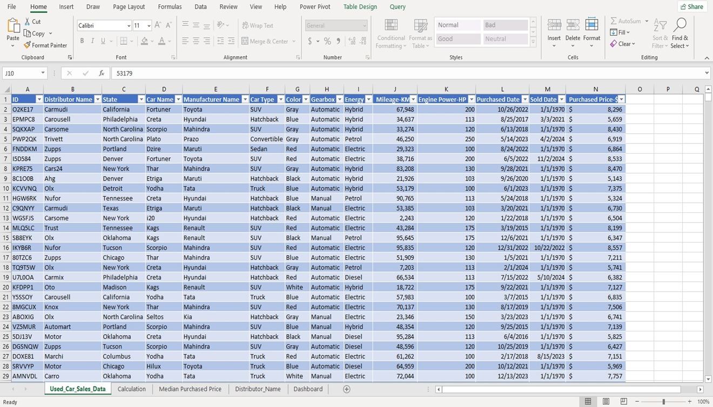
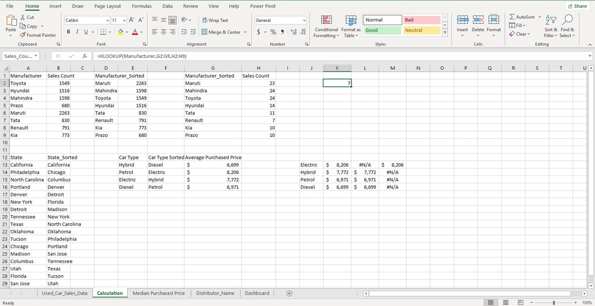
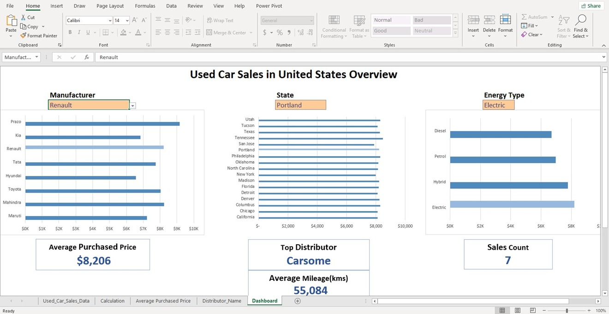

# 🚗 Used Car Sales Dashboard (Excel Project)

## 📌 Project Overview  
This project presents an **interactive Excel dashboard** that analyzes **used car sales in the United States**.  
The dashboard highlights important **key performance indicators (KPIs)** to provide insights into how different factors influence sales trends.  

---

## 🎯 Objectives  
- Collected and cleaned raw dataset from **Kaggle**  
- Designed a **dynamic Excel dashboard** for data analysis  
- Focused on KPIs such as:  
  - Manufacturer  
  - Location (State/Region)  
  - Energy Type  
  - Mileage  
  - Top Distributor  

---

## ⚙️ Features & Functions Used  
The following Excel functions and tools were used to build the dashboard:  
- `UNIQUE` – Extract unique values for KPIs  
- `SORT` – Organize data logically  
- `COUNTIF` – Count sales by category  
- `AVERAGEIF` – Calculate average purchase price & mileage  
- `XLOOKUP` – Perform flexible lookups  
- `IF` – Logical conditions  
- **Data Validation** – Ensure clean and structured inputs  

---

## 🛠️ Steps Involved  

### 1. Data Import & Formatting  
- Imported CSV data from Kaggle  
- Formatted into tables with appropriate data types (currency, date, number, etc.)  

---

### 2. KPI Identification & Calculations  
- Applied `UNIQUE` & `SORT` to structure KPIs  
- Used `COUNTIF` and `AVERAGEIF` for state, manufacturer, and mileage analysis  

---

### 3. Dashboard Creation  
- Designed an **interactive Excel dashboard**  
- Final KPIs included:  
  - Sales Count  
  - Average Purchase Price  
  - Manufacturer Trends  
  - State-wise Sales  
  - Energy Type Analysis  
  - Top Distributors  

---

## 📊 Final Dashboard  
The dashboard provides a **comprehensive view of used car sales trends** in the U.S., enabling quick insights for decision-making.  

---

## 📂 Project Structure  
📁 Used-Car-Sales-Dashboard
┣ 📄 README.md
┣ 📊 Used_Car_Sales_Dashboard.xlsx
┣ 📄 Project_Description.pdf
┗ 📁 images
┣ raw-data.jpg
┣ calculation.jpg
┗ dashboard.jpg

---

## 🤝 Contribution  
Contributions, suggestions, and feedback are welcome!  
Feel free to fork the repository and submit pull requests.  

---

## 📧 Contact  
Author: **Shahid Abbas**  
Email: [shahidabbas2104514@gmail.com](mailto:shahidabbas2104514@gmail.com)  

